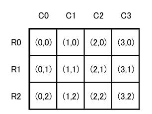
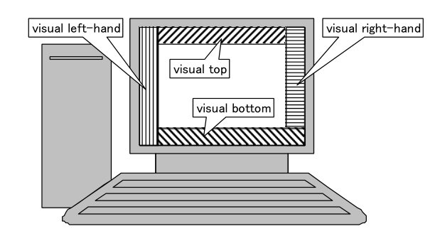
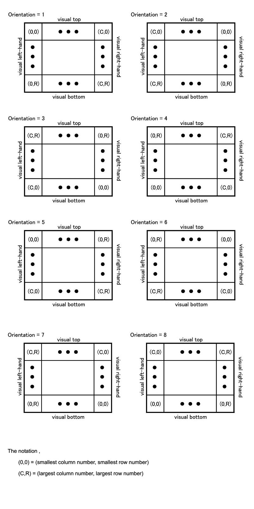

# 图片方向(Orientation)
> The image orientation viewed in terms of rows and columns.  
基于EXIF version2.3

#### 1. orientation
**Orientation有八个值: 1, 2, 3, 4, 5, 6, 7, 8;对应不同的翻转角度**

* **case 1:** 
The 0th row is at the visual top of the image, 
and the 0th column is the visual left-hand side.

* **case 2:** 
The 0th row is at the visual top of the image, 
and the 0th column is the visual right-hand side.

* **case 3:** 
The 0th row is at the visual bottom of the image, 
and the 0th column is the visual right-hand side.

* **case 4:** 
The 0th row is at the visual bottom of the image, 
and the 0th column is the visual left-hand side.

* **case 5:** 
The 0th row is the visual left-hand side of the image, 
and the 0th column is the visual top.

* **case 6:** 
The 0th row is the visual right-hand side of the image, 
and the 0th column is the visual top.

* **case 7:** 
The 0th row is the visual right-hand side of the image, 
and the 0th column is the visual bottom.

* **case 8:** 
The 0th row is the visual left-hand side of the image, 
and the 0th column is the visual bottom.

* **Other:** reserved

问：
上面的row, column, visual top, visual bottom, visual left-hand, visual right-hand都是什么意思呢?   

答：
1. jpeg格式的图片其实是线性排列的一组二进制数据，
它是按照**图1**方式排列的，
R0, R1, R2等表示row, C0, C1, C2等表示column,
row和column的长度都是1px
所以，一张图片的宽度等于所有column的和，高度等于所有row的和  

     
   **(图1) Data array of an Exif image file**

2. 在一个显示设备上显示一张图片，其视觉方向如**图2**所示；

      
   **(图2) orientation of an image display on a display device**
   
3. 每个orientation值对应的显示状态如**图3**所示  

     
   **(图3) Relationship between image data and orientation on a display screen according to an orientation tag**
   
#### 2. 如何获取orientation
